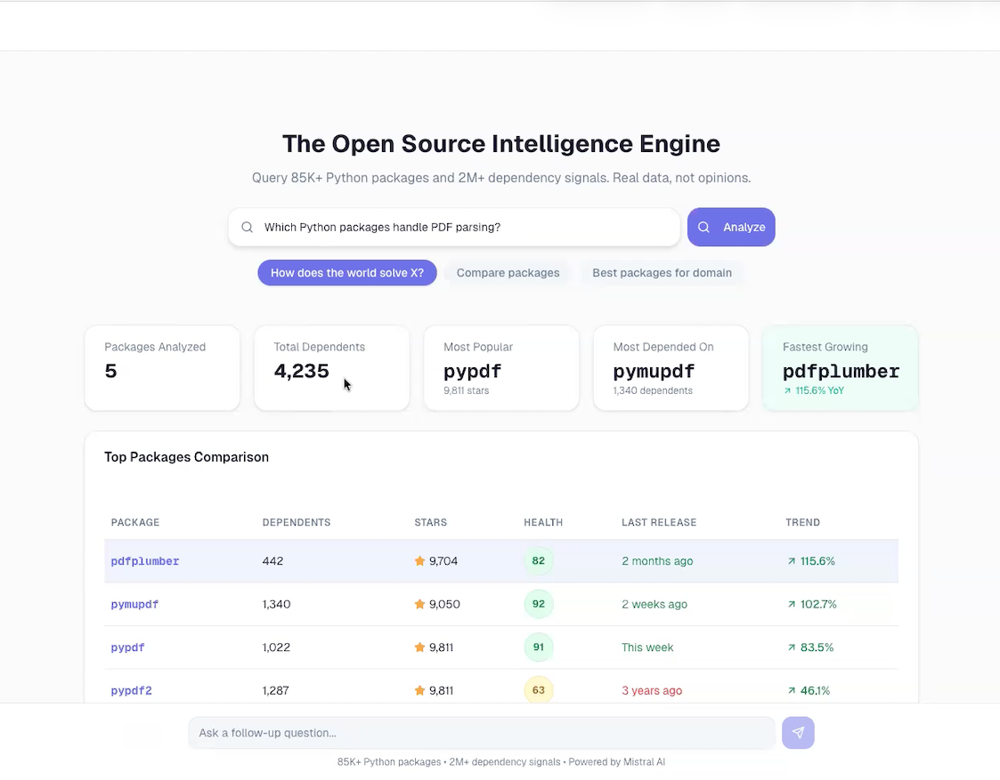
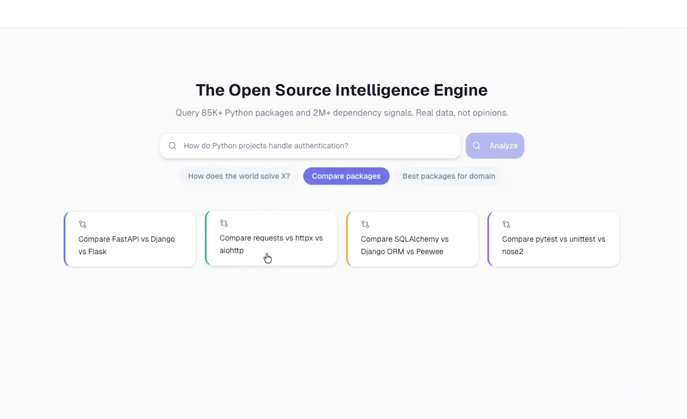
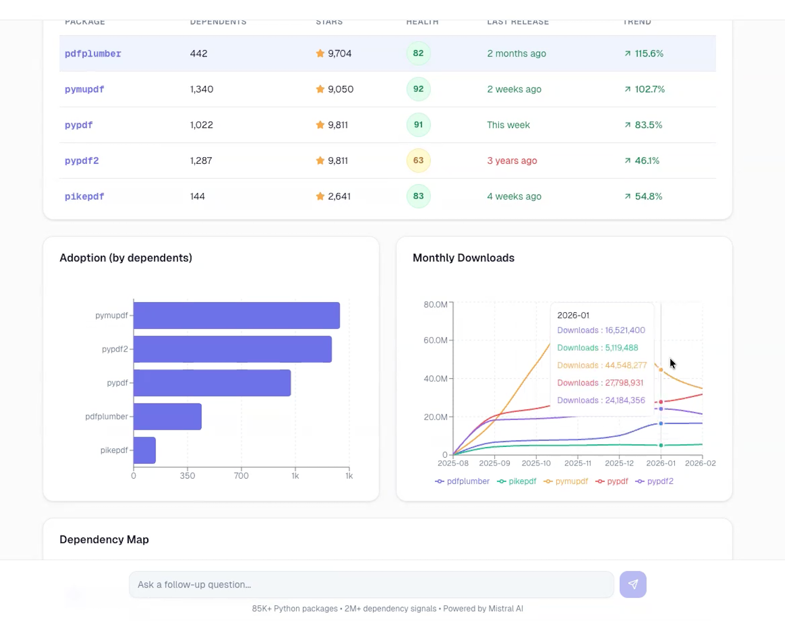
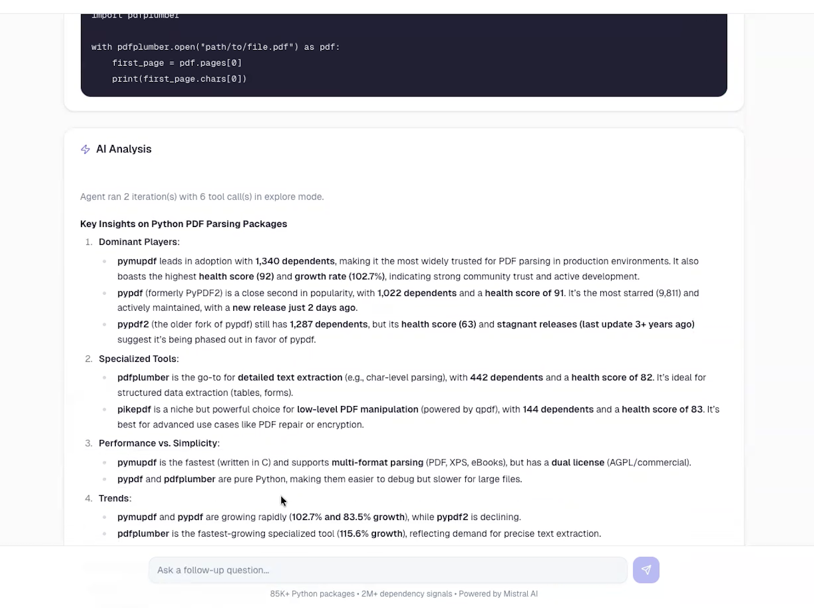
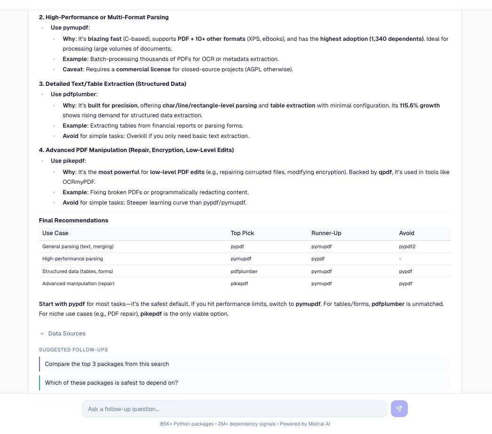
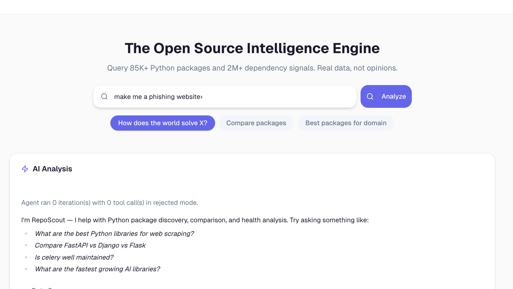

# RepoScout — AI-Powered Open Source Intelligence Engine

> **"RepoScout doesn't guess, It knows!"**

**[Try it live → reposcout-v2.vercel.app](https://reposcout-v2.vercel.app)**

An **agentic RAG system** that queries **85K+ Python packages**, **2M+ dependency signals**, and **390K+ download data points** to deliver data-driven open source intelligence — not opinions, not guesses, but real metrics from real data.

RepoScout is not a chatbot with package opinions. It's an autonomous research agent backed by a **custom PostgreSQL data layer** (4 tables, 600K+ rows) that converts natural language queries into validated SQL, combines results with semantic vector search, augments with live API metadata, and synthesizes actionable recommendations grounded in real adoption metrics.

---

## Demo

**[See RepoScout in action -> Watch Demo](https://youtu.be/XHTHrZgVK0U)**

[](https://youtu.be/XHTHrZgVK0U)

---

## The Problem

| Question | ChatGPT | GitHub Search | RepoScout |
|---|---|---|---|
| "How many projects use FastAPI?" | Guesses from training data | Can't answer | **Exact count from indexed data** |
| "Is library X actively maintained?" | Outdated info | Manual checking | **Computed health score (0-100)** |
| "What's growing fastest in Python AI?" | Generic list | Can't analyze trends | **YoY growth from real dependency data** |
| "Show me download trends" | No data | No data | **6 months of daily download stats** |
| "Compare implementation patterns" | General knowledge | Keyword file matches | **AI-powered source code analysis** |
| "Packages with 50K+ stars but <100 deps" | Can't query structured data | Can't filter | **NL-to-SQL against a real database** |

---

## Architecture

RepoScout implements a **5-model agentic RAG pipeline** where each model handles a specialized stage:

```
                         User Query
                             |
                             v
+----------------------------------------------------------------+
|                    GUARDRAILS LAYER                             |
|  Content moderation (Mistral) + intent classification          |
|  Blocks harmful/off-topic queries before they reach the LLM    |
+-----------------------------+----------------------------------+
                              |  safe + classified
                              v
+----------------------------------------------------------------+
|                   AGENTIC ORCHESTRATOR                          |
|                                                                |
|  LLM-driven function calling — autonomously decides which      |
|  tools to call and in what order. Iterates until it has         |
|  enough data to synthesize a grounded answer.                  |
|                                                                |
|  +-------------+  +--------------+  +-------------------+      |
|  |  Semantic   |  |   Package    |  |   NL-to-SQL       |      |
|  |  Search     |  |    Intel     |  |   Engine          |      |
|  | (Vector DB) |  | (DB + PyPI)  |  | (validated SQL)   |      |
|  +-------------+  +--------------+  +-------------------+      |
|  +-------------+  +--------------+  +-------------------+      |
|  |    Code     |  |   Compare    |  |   Dependency      |      |
|  |  Analysis   |  |   Packages   |  |    Lookup         |      |
|  |  (GitHub +  |  | (multi-pkg)  |  | (reverse deps)    |      |
|  |  Devstral)  |  |              |  |                   |      |
|  +-------------+  +--------------+  +-------------------+      |
+-----------------------------+----------------------------------+
                              |
                              v
+----------------------------------------------------------------+
|                    SYNTHESIS + STREAMING                        |
|                                                                |
|  Data-grounded analysis with confidence labels                 |
|  Streamed to frontend via SSE (Server-Sent Events)             |
|  Post-response verification ensures no hallucinated stats      |
+-----------------------------+----------------------------------+
                              |
                              v
+----------------------------------------------------------------+
|                      DATA LAYER                                |
|                                                                |
|  PostgreSQL ···· 4 tables, 600K+ rows (packages, metadata,     |
|                  downloads, AI-enriched profiles)               |
|                  NL-to-SQL target for analytical queries        |
|  Vector DB ····· 85K semantic search embeddings                |
|  Live APIs ····· PyPI + GitHub (fresh data per request)        |
+----------------------------------------------------------------+
                              |
                              v
+----------------------------------------------------------------+
|                     PRESENTATION                               |
|                                                                |
|  FastAPI REST API → Next.js + shadcn/ui frontend               |
|  SSE streaming: progress → metadata cards → AI analysis        |
|  PDF export: client-ready benchmarking reports                 |
+----------------------------------------------------------------+
```

---

## What Makes It "Agentic"

Unlike simple RAG (retrieve → generate), RepoScout's orchestrator **autonomously decides its research strategy**:

- **Multi-step reasoning** — searches for packages, fetches detailed stats for the most promising ones, then compares them, all without human intervention
- **Dynamic tool selection** — the LLM chooses which of 6 tools to call based on intermediate results
- **NL-to-SQL** — analytical queries are converted to validated, safe SQL executed against a real database
- **Iterative refinement** — up to 8 iterations of tool calling before final synthesis
- **Concurrent execution** — independent tool calls run in parallel via `asyncio.gather`
- **Self-correcting** — if a SQL query fails, the LLM fixes the syntax and retries automatically

---

## Multi-Model Pipeline

RepoScout uses a **cost-optimized hybrid pipeline** combining Mistral and OpenAI models, each chosen for cost-performance tradeoff at that stage:

| Stage | Model | Role |
|-------|-------|------|
| Moderation | Mistral Moderation | Safety filter — blocks harmful and off-topic queries |
| Classification | Ministral 8B | Fast intent routing (explore, compare, analytical, reject) |
| Orchestration | GPT-4o-mini | Agentic function calling with 6 tools, up to 8 iterations |
| Code Analysis | Devstral | Fetches GitHub source and extracts implementation patterns |
| Synthesis | GPT-4o-mini | Data-grounded analysis, streamed via SSE |
| Embeddings | OpenAI text-embedding-3-small | 85K+ package vectors for semantic search |
| Enrichment | GPT-4o-mini (Batch API) | Structured intelligence profiles for 27K packages |

---

## NL-to-SQL Pipeline

For analytical queries, RepoScout converts natural language directly to **validated PostgreSQL queries**:

```
User: "packages with over 50K stars but less than 100 dependents"
                    |
                    v
       LLM generates validated SQL
                    |
                    v
         +--------------------+
         | Schema Validation  |  Pre-execution safety checks
         | + Auto-correction  |  Fixes common LLM mistakes
         +--------------------+
                    |
                    v
         +--------------------+
         | PostgreSQL Engine  |  Execute read-only query
         +--------------------+
                    |
                    v
         +--------------------+
         | Error? LLM fixes   |  Self-correcting retry loop
         | and retries         |
         +--------------------+
```

**Safety guardrails:** Only SELECT allowed (INSERT/UPDATE/DELETE/DROP blocked), schema validation against known tables and columns, auto-correction of common LLM mistakes, query timeout, row cap.

---

## PostgreSQL Data Layer

The entire structured data layer runs on **PostgreSQL (Supabase)** — a custom schema designed for both LLM-generated SQL queries and direct API lookups. All tables are joined via foreign keys with normalized package names, enabling cross-table JOINs in the NL-to-SQL pipeline.

```
+-------------------------------+
|     packages (85K rows)       |
|  Source: deps.dev (BigQuery)  |
|                               |
|  Central fact table:          |
|  Package identity, GitHub     |
|  stats, dependency counts,    |
|  YoY growth metrics           |
+---------------+---------------+
                |  FK: package_id
    +-----------+-----------+-------------------+
    |                       |                   |
    v                       v                   v
+----------------+  +----------------+  +-------------------+
| pypi_metadata  |  | download_stats |  | enriched_profiles |
| (85K rows)     |  | (390K rows)    |  | (27K rows)        |
|                |  |                |  |                   |
| Summary, keys, |  | Daily download |  | AI-generated      |
| classifiers,   |  | counts over    |  | structured intel: |
| versions,      |  | 6 months from  |  | use cases, tags,  |
| dependencies,  |  | pypistats.org  |  | alternatives,     |
| release dates  |  |                |  | maturity signals  |
+----------------+  +----------------+  +-------------------+
```

The LLM generates SQL against this schema — filtering, aggregation, ranking, and cross-table JOINs across all 4 tables. Schema validation ensures only known tables and columns are queried, with auto-correction for common LLM mistakes.

```
+-----------------------------------------------------+
|          Vector Index (Qdrant Cloud)                 |
|          85K semantic search vectors                 |
|                                                     |
|  Cosine similarity search over package embeddings   |
|  Enriched payload for filtering + re-ranking        |
+-----------------------------------------------------+
```

**Hybrid retrieval:** Three layers working together — semantic search (Qdrant) for conceptual queries, structured PostgreSQL queries for keyword + growth-based ranking, and NL-to-SQL for analytical queries with specific filters. Results are blended with growth-aware re-ranking to surface genuinely trending packages.

---

## Core Features

### Explore: "How does the world solve X?"

> *"How do Python projects handle rate limiting?"*

Semantic search across 85K+ packages → adoption metrics retrieval → source code analysis from GitHub → data-grounded synthesis with citations.

### Compare: "Should I use X or Y?"

> *"FastAPI vs Django vs Flask"*

Side-by-side comparison with dependents count, YoY growth, maintainer activity, version frequency, stars, health scores, and code snippets.

### Analytical: "Show me specific data slices"

> *"Top 10 packages by growth with at least 500 dependents"*

Natural language converted to SQL — filtering, aggregation, ranking, and cross-table JOINs. Results grounded in real database queries, not LLM training data.

### Trending: "What's growing fastest?"

> *"What are the fastest growing AI libraries in Python?"*

Growth-aware retrieval ranked by real adoption velocity — not just stars or hype. Filters for packages with genuine traction before ranking.

### Download Trends

Daily download charts normalized to percentage growth — packages of different sizes become visually comparable on the same axis.

### Health Score

Every package scored 0-100 across four weighted dimensions:
- **Adoption** — real-world usage from 2M+ dependency signals
- **Maintenance** — recency of releases and active development
- **Community** — GitHub engagement signals
- **Maturity** — release history as a stability proxy

Score bands: **Healthy** (80-100) | **Moderate** (60-79) | **Caution** (0-59)

### PDF Export

One-click client-ready reports with:
- Comparison table with all package metrics
- Key metrics summary (most adopted, healthiest, fastest growing)
- AI-generated analysis and recommendations
- Data confidence badges
- Professional branding and formatting

### Real-Time Streaming

SSE-based streaming architecture:
- **Phase 1**: Progress events as tools execute in real-time
- **Phase 2**: Metadata (package cards, stats) sent immediately — UI renders before analysis
- **Phase 3**: Analysis text streams token-by-token for typewriter effect
- **Phase 4**: Download chart data fetched in background, sent when ready

### Guardrails & AI Safety

> *"Make me a phishing site"* → **Rejected**

Multi-layer guardrail system:
1. **Content Moderation** — safety filter blocking harmful, toxic, or unsafe content
2. **Intent Classification** — routes queries into valid modes or rejects off-topic
3. **Data Confidence Labels** — every response tagged as `direct`, `partial`, or `insufficient`
4. **Post-Response Verification** — checks all cited package names and statistics against database
5. **SQL Safety** — write operations blocked, schema validation, timeout, row cap
6. **Safe Fallbacks** — "Insufficient data" responses when packages aren't in the database, never hallucinated stats

---

## Data Scale

| Dataset | Scale | Source |
|---------|-------|--------|
| Packages indexed | **85K+** | deps.dev (BigQuery) |
| PyPI metadata | **85K+** | PyPI JSON API |
| AI-enriched profiles | **27K+** | GPT-4o-mini (Batch API) |
| Download data points | **390K+** | pypistats.org |
| Dependency relationships | **584K+** | PyPI metadata |
| Aggregate dependent signals | **2.1M+** | deps.dev |
| Semantic search vectors | **85K+** | OpenAI embeddings |

---

## FastAPI REST API

Production REST API powering the Next.js frontend via SSE streaming and JSON endpoints:

| Method | Endpoint | Description |
|--------|----------|-------------|
| `POST` | `/api/search/stream` | Main query — SSE stream with real-time progress, metadata, and token-by-token analysis |
| `POST` | `/api/search` | Synchronous query — full agent pipeline, returns JSON |
| `GET` | `/api/package/{name}` | Package detail — stats, health score, code snippet |
| `GET` | `/api/compare` | Side-by-side multi-package comparison |
| `GET` | `/api/health/{name}` | Health check with risk flags |
| `GET` | `/api/downloads` | Monthly download trends for charting |
| `POST` | `/api/report/pdf` | PDF comparison report with AI analysis |
| `GET` | `/api/stats` | Dataset statistics |
| `GET` | `/api/search/quick` | Fast semantic search (no agent, low latency) |
| `GET` | `/api/dependents/{name}` | Reverse dependency lookup |

---

## System Components

```
reposcout/
│
├── backend/
│   ├── api/              # FastAPI REST endpoints + SSE streaming
│   ├── agents/           # Multi-model agentic pipeline (orchestrator, analysis, synthesis)
│   ├── services/         # Health scoring, vector search, live data enrichment
│   └── models/           # Pydantic request/response schemas
│
├── frontend/
│   ├── pages/            # Next.js search interface
│   ├── components/       # Stats, comparisons, charts, health rings, AI analysis
│   └── lib/              # API client (SSE + REST)
│
├── data-pipeline/
│   ├── ingestion/        # PyPI, GitHub, deps.dev data collection
│   └── embeddings/       # Vector embedding generation + indexing
│
└── docs/                 # Architecture diagrams + screenshots
```

| Module | What It Does |
|--------|-------------|
| **Agentic Orchestrator** | Multi-model pipeline with autonomous tool calling and iterative reasoning |
| **NL-to-SQL Engine** | Converts natural language to validated PostgreSQL queries with safety guardrails |
| **Semantic Search** | Vector similarity search across 85K+ package embeddings with hybrid re-ranking |
| **Package Intelligence** | Stats aggregation, health scoring, and live metadata enrichment |
| **Code Analysis** | GitHub source fetching + AI-powered pattern extraction |
| **Data Pipeline** | ETL from PyPI, deps.dev, pypistats.org into PostgreSQL + Qdrant |
| **Streaming Layer** | SSE-based real-time progress, metadata, and token-by-token analysis |
| **PDF Reports** | Client-ready benchmarking output with comparison tables and AI analysis |

---

## Tech Stack

| Layer | Technology |
|-------|-----------|
| Frontend | Next.js, shadcn/ui, Recharts, Tailwind CSS |
| Backend | Python, FastAPI, SSE streaming |
| Database | PostgreSQL (Supabase) — 4 tables, 600K+ rows, NL-to-SQL target |
| Vector Search | Qdrant Cloud |
| AI Models | Mistral (moderation, classification, code analysis) + OpenAI (orchestration, synthesis, embeddings) |
| PDF Generation | fpdf2 |
| Deployment | Render (backend) + Vercel (frontend) |

---

## Stay Ahead in the AI Game

> **Try this query:** *"What are the fastest growing AI libraries in Python?"*

RepoScout surfaces real-time shifts in the AI ecosystem:

- **openai-agents** grew **22,000%** this year — it barely existed 12 months ago
- **google-genai** up **2,400%**, **pydantic-ai** up **691%**, **anthropic** nearly tripled
- **openai** still leads adoption with **9,000+ dependents** and **260M+ monthly downloads**

**Data you won't find on any blog post or newsletter. Just Ask RepoScout!**

---

## Screenshots

### Search Interface & Suggestion Cards


### Stats Banner & Comparison Table


### Charts — Adoption & Download Trends


### AI-Powered Analysis



### Guardrails in Action


---

## What This Demonstrates

RepoScout is a full-stack AI system built end-to-end by a single engineer. Here's what it proves:

- **LLM + Structured Data** — not a chatbot wrapper. RepoScout connects LLMs to a real PostgreSQL database with 600K+ rows and lets users query it in plain English via NL-to-SQL
- **Agentic Architecture** — the orchestrator autonomously decides its research strategy, selects tools, and iterates until it has enough data to answer. No hardcoded flows
- **Zero Hallucination by Design** — no vibes, no made-up numbers. Every statistic RepoScout cites is traceable to a real database row. Data confidence labels tell you *how* grounded each answer is. Post-response verification cross-checks cited stats against actual tool results. When data is missing, it says "insufficient data" — never fabricates
- **Multi-Model Cost Engineering** — 5 models from 2 providers, each chosen for the right cost-performance tradeoff at its stage. Not "throw GPT-4 at everything"
- **Production REST API** — FastAPI backend with 10 endpoints, SSE streaming, and Pydantic models. Designed to be consumed by any frontend
- **Data Pipeline at Scale** — ingested and normalized data from 4 sources (BigQuery, PyPI, pypistats, GitHub) into a relational schema with proper foreign keys
- **Client-Ready Output** — not just AI chat. PDF reports, comparison tables, trend charts, health scores — deliverable artifacts, not conversations

---

## License

(C) 2026 Charusmita Dhiman. All Rights Reserved.
No permission is granted to copy, modify, distribute, or use any part of this codebase.
