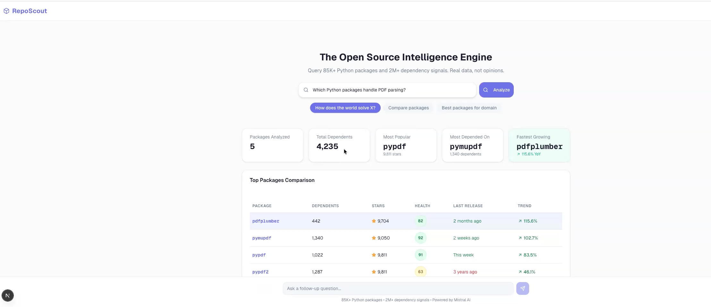
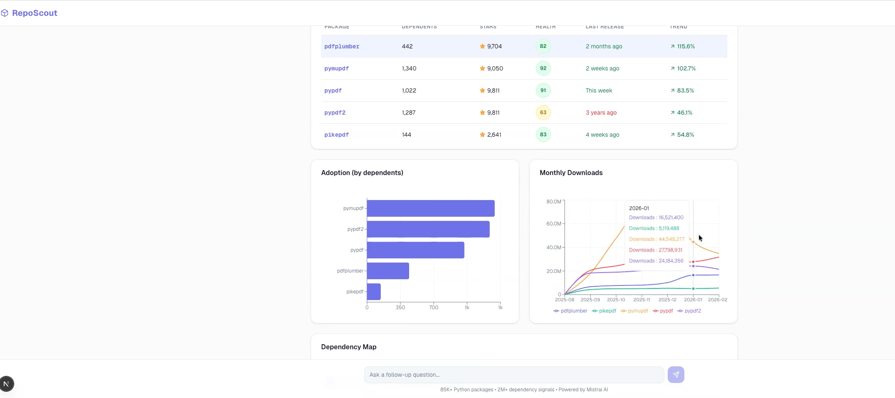
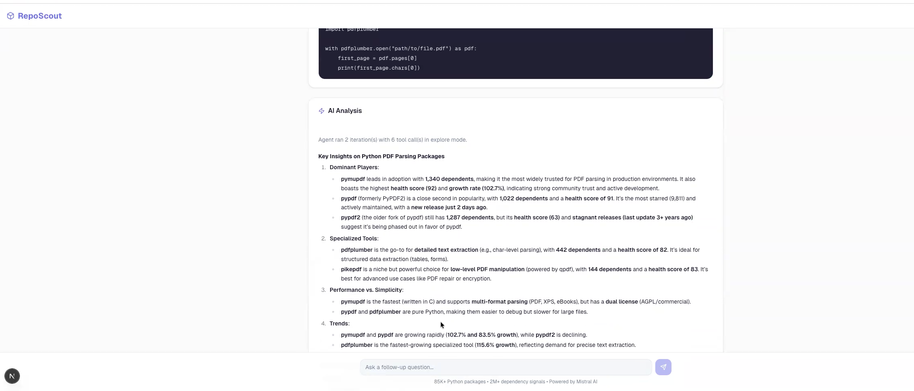

# RepoScout — AI-Powered Open Source Intelligence Engine

> **"RepoScout doesn't guess — it knows."**

An **agentic RAG system** that queries **85K+ Python packages** (2020–2026 data), **2M+ dependency signals**, and **390K+ download data points** to deliver data-driven open source intelligence. Built on a **multi-model Mistral AI pipeline** with function calling, semantic retrieval, and real-time code analysis.

RepoScout is not a chatbot with package opinions. It's an autonomous research agent that retrieves structured data from a pre-indexed PyPI ecosystem snapshot, augments it with live metadata and source code, and synthesizes actionable recommendations grounded in real adoption metrics.

---

## Agentic RAG Architecture

RepoScout implements a **5-model agentic RAG pipeline** where each model handles a specialized stage:

```
User Query
    │
    ▼
┌─────────────────────────────────────────────────────────┐
│  STAGE 1: MODERATION (mistral-moderation-latest)        │
│  Safety filter — blocks harmful/off-topic queries       │
└────────────────────────┬────────────────────────────────┘
                         │ safe
                         ▼
┌─────────────────────────────────────────────────────────┐
│  STAGE 2: CLASSIFICATION (Ministral 8B)                 │
│  Intent routing — explore | compare | reject            │
│  Fast, cheap (10 tokens max), 3-class classifier        │
└────────────────────────┬────────────────────────────────┘
                         │ mode
                         ▼
┌─────────────────────────────────────────────────────────┐
│  STAGE 3: ORCHESTRATION (Mistral Large)                 │
│  Agentic function calling — up to 8 iterations          │
│                                                         │
│  5 tools available:                                     │
│  ┌─────────────────┐ ┌──────────────────┐               │
│  │ search_packages │ │ get_package_stats│               │
│  │ (Qdrant + DuckDB│ │ (DuckDB + PyPI)  │               │
│  │  semantic + kw)  │ │                  │               │
│  └─────────────────┘ └──────────────────┘               │
│  ┌──────────────────┐ ┌──────────────────┐              │
│  │ compare_packages │ │get_dependents_cnt│              │
│  │ (multi-pkg stats)│ │ (reverse deps)   │              │
│  └──────────────────┘ └──────────────────┘              │
│  ┌──────────────────┐                                   │
│  │ fetch_source_code│ ← calls Devstral for analysis     │
│  │ (GitHub raw URLs)│                                   │
│  └──────────────────┘                                   │
│                                                         │
│  Iteration loop:                                        │
│  1. LLM decides which tools to call                     │
│  2. Tools execute concurrently (asyncio.gather)         │
│  3. Results fed back as tool messages                   │
│  4. LLM decides: call more tools or synthesize          │
│  5. Repeat until done (max 8 iterations)                │
└────────────────────────┬────────────────────────────────┘
                         │
                         ▼
┌─────────────────────────────────────────────────────────┐
│  STAGE 4: CODE ANALYSIS (Devstral)                      │
│  Fetches source from GitHub raw URLs                    │
│  AI-powered pattern extraction and code review          │
└────────────────────────┬────────────────────────────────┘
                         │
                         ▼
┌─────────────────────────────────────────────────────────┐
│  STAGE 5: SYNTHESIS (Mistral Large)                     │
│  Generates data-grounded analysis                       │
│  Cites specific numbers, never hallucinates stats       │
│  Streams response via SSE (token-by-token)              │
└─────────────────────────────────────────────────────────┘
```

### What makes it "Agentic"

Unlike simple RAG (retrieve → generate), RepoScout's orchestrator **autonomously decides its research strategy**:

- **Multi-step reasoning**: Searches for packages, then fetches detailed stats for the most promising ones, then compares them — all without human intervention
- **Tool selection**: The LLM dynamically chooses which tools to call based on intermediate results
- **Iterative refinement**: If initial search results aren't sufficient, the agent calls additional tools in subsequent iterations
- **Concurrent execution**: Multiple tool calls within the same iteration run in parallel via `asyncio.gather`

### Retrieval Strategy: Hybrid Semantic + Structured

RepoScout combines two retrieval layers for maximum recall:

1. **Semantic Search** (Qdrant Cloud) — 80K+ vectors from Mistral Embed (1024 dims). Matches conceptual queries like "libraries for building AI agents" even when the exact words don't appear in package descriptions
2. **Structured Search** (DuckDB) — keyword matching + growth-based ranking. Supplements semantic results with packages that have high adoption metrics
3. **Growth Supplementation** — For trending/growth queries, DuckDB results sorted by `growth_pct * LN(dependent_count + 1)` are merged first, ensuring high-growth packages with real adoption aren't buried by semantic similarity alone
4. **Quality Filtering** — Post-retrieval filter removes noise (requires 100+ dependents for Qdrant results). Blended re-ranking: `semantic_score * 0.6 + popularity * 0.25 + growth_boost * 0.15`

---

## 5 Mistral AI Models

| Model | Stage | Role | Why this model |
|-------|-------|------|----------------|
| **Mistral Moderation** | Safety | Content moderation — blocks unsafe/off-topic queries | Purpose-built classifier, near-zero latency |
| **Ministral 8B** | Classification | Intent routing (explore / compare / reject) | Fast, cheap, accurate for 3-class classification |
| **Mistral Large** | Orchestration | Agentic function calling with 5 tools, up to 8 iterations | Best tool-use accuracy, handles complex multi-step reasoning |
| **Devstral** | Code Analysis | Fetches GitHub source and extracts implementation patterns | Optimized for code understanding |
| **Mistral Embed** | Retrieval | 80K+ package embeddings (1024 dims) in Qdrant Cloud | High-quality semantic vectors for package discovery |

---

## Dataset

| Dataset | Count | Source |
|---------|-------|--------|
| Packages indexed | **85,209** | deps.dev (BigQuery) |
| PyPI metadata (READMEs, keywords, versions) | **85,132** | PyPI JSON API |
| Download data points (daily, 6 months) | **390,661** | pypistats.org |
| Dependency relationships (requires_dist) | **584K+** | PyPI metadata |
| Aggregate dependent signals | **2.1M+** | deps.dev |
| Semantic search vectors | **80K+** | Mistral Embed |

---

## Database Schema

### DuckDB — Structured Data (3 tables)

```
┌─────────────────────────────────────────────────────────────┐
│  packages (85,209 rows)                                     │
│  Primary source: Google deps.dev via BigQuery               │
├─────────────────────────────────────────────────────────────┤
│  package_name          VARCHAR   ── primary key             │
│  dependent_count       BIGINT    ── 2024 dependents         │
│  dependent_count_2025  BIGINT    ── 2025 dependents         │
│  growth_pct            DOUBLE    ── YoY growth percentage   │
│  stars                 BIGINT    ── GitHub stars             │
│  forks                 BIGINT    ── GitHub forks             │
│  open_issues           BIGINT    ── GitHub open issues       │
│  github_repo           VARCHAR   ── GitHub owner/repo        │
│  description           VARCHAR   ── package description      │
│  homepage              VARCHAR   ── project homepage URL     │
└─────────────────────────────────────────────────────────────┘
        │ JOIN ON LOWER(package_name) = LOWER(name)
        ▼
┌─────────────────────────────────────────────────────────────┐
│  pypi_metadata (85,132 rows)                                │
│  Source: PyPI JSON API (bulk-fetched, cached)               │
├─────────────────────────────────────────────────────────────┤
│  name                  VARCHAR   ── PyPI package name        │
│  summary               VARCHAR   ── one-line description     │
│  description           VARCHAR   ── full README content      │
│  description_content_type VARCHAR ── text/markdown, text/x-rst│
│  keywords              VARCHAR   ── author-defined keywords  │
│  classifiers           VARCHAR   ── PyPI trove classifiers   │
│  version               VARCHAR   ── latest version           │
│  author                VARCHAR   ── package author           │
│  license               VARCHAR   ── license identifier       │
│  requires_python       VARCHAR   ── Python version constraint│
│  requires_dist         VARCHAR   ── dependency list (584K+)  │
│  total_versions        BIGINT    ── number of releases       │
│  latest_release_date   VARCHAR   ── most recent release      │
│  first_release_date    VARCHAR   ── initial release          │
└─────────────────────────────────────────────────────────────┘

┌─────────────────────────────────────────────────────────────┐
│  download_stats (390,661 rows)                              │
│  Source: pypistats.org API (daily, 6-month window)          │
├─────────────────────────────────────────────────────────────┤
│  package_name          VARCHAR   ── PyPI package name        │
│  month                 VARCHAR   ── YYYY-MM aggregation      │
│  downloads             BIGINT    ── monthly download count   │
└─────────────────────────────────────────────────────────────┘
```

### Qdrant Cloud — Semantic Search Index

```
┌─────────────────────────────────────────────────────────────┐
│  Collection: "packages" (80K+ vectors)                      │
│  Cluster: Qdrant Cloud                                      │
├─────────────────────────────────────────────────────────────┤
│  VECTOR                                                     │
│  └── 1024 dimensions (Mistral Embed)                        │
│      Distance metric: Cosine similarity                     │
│                                                             │
│  PAYLOAD (per vector)                                       │
│  ├── name              string  ── package name              │
│  ├── summary           string  ── one-line description      │
│  ├── stars             int     ── GitHub stars               │
│  ├── dependent_count   int     ── downstream dependents     │
│  ├── growth_pct        float   ── YoY growth percentage     │
│  ├── version           string  ── latest version            │
│  └── embedding_text    string  ── cleaned text for embedding│
│                                                             │
│                                                             │
│  EMBEDDING SOURCE TEXT (per package)                        │
│  Built from: name + summary + keywords + classifiers +     │
│  cleaned README sections (50-500 tokens after 7-phase      │
│  cleaning pipeline)                                         │
└─────────────────────────────────────────────────────────────┘
```

### How the layers connect

```
User query: "best libraries for building AI agents"
                    │
                    ▼
        ┌───────────────────┐
        │   Qdrant Cloud    │──→ Semantic match on embedding_text
        │   (80K vectors)   │    Returns: name, stars, deps, growth
        └───────────────────┘
                    │ top results
                    ▼
        ┌───────────────────┐
        │  DuckDB: packages │──→ Enrich with full stats (forks,
        │  + pypi_metadata  │    issues, README, license, versions)
        └───────────────────┘
                    │ enriched data
                    ▼
        ┌───────────────────┐
        │  DuckDB: download │──→ Monthly download trends
        │  _stats           │    for chart visualization
        └───────────────────┘
                    │ complete package profile
                    ▼
        ┌───────────────────┐
        │  PyPI API (live)  │──→ Fresh version, release date,
        │                   │    maintainer activity
        └───────────────────┘
```

---

## RepoScout Health Score

Every package receives a computed health score from 0-100, grounded in real ecosystem signals:

```
Score = 0.35 * Adoption + 0.30 * Maintenance + 0.20 * Community + 0.15 * Maturity
```

| Weight | Factor | Formula |
|--------|--------|---------|
| 35% | **Adoption** | `min(100, log10(dependents + 1) * 25)` — real-world usage from 2.1M+ dependency signals |
| 30% | **Maintenance** | Tiered by days since last release: <=30d=100, <=90d=80, <=180d=60, <=1yr=40, <=2yr=20, else=5 |
| 20% | **Community** | `min(100, log10(stars + 1) * 30)` — GitHub engagement signal |
| 15% | **Maturity** | `min(100, total_versions * 3)` — release history as stability proxy |

**Score bands:** 80-100 Healthy (green) | 60-79 Moderate (yellow) | 0-59 Caution (red)

---

## Why RepoScout?

| Capability | ChatGPT | GitHub Search | RepoScout |
|---|---|---|---|
| "How many projects use FastAPI?" | Guesses from training data | Can't answer | **Exact count from indexed data** |
| "Is library X actively maintained?" | Outdated info | Manual checking | **Computed health score (0-100)** |
| "What's growing fastest in Python AI?" | Generic list | Can't analyze trends | **YoY growth from real dependency data** |
| "Show me download trends" | No data | No data | **6 months of daily PyPI downloads** |
| "Compare implementation patterns" | General knowledge | Keyword file matches | **Source code analysis via Devstral** |

---

## Core Features

### Explore: "How does the world solve X?"

> *"How do Python projects handle rate limiting?"*

The agent searches 85K+ package descriptions semantically, retrieves adoption metrics for the top results, fetches actual source code from GitHub, and synthesizes a data-grounded comparison.

### Compare: "Should I use X or Y?"

> *"FastAPI vs Django vs Flask"*

Side-by-side comparison with dependents count, YoY growth, maintainer activity, version frequency, stars, health scores, and code snippets extracted from READMEs.

### Trending: "What's growing fastest?"

> *"What are the fastest growing AI libraries in Python?"*

Growth-aware pipeline that surfaces packages by real adoption velocity — not just stars or hype. Filters for packages with genuine traction (200+ dependents, 500+ stars) before ranking by growth rate.

### Download Trends

Monthly download trend charts for analyzed packages — see which libraries are gaining or losing traction over the past 6 months.

---

## **BONUS: Stay Ahead in the AI Game**

> **Try this query:** *"What are the fastest growing AI libraries in Python?"*

RepoScout surfaces real-time shifts in the AI ecosystem that can be the best way to keep up with latest AI trends

- **openai-agents** grew **22,000%** this year — it barely existed 12 months ago
- **google-genai** up **2,400%**, **pydantic-ai** up **691%**, **anthropic** nearly tripled
- **openai** still leads adoption with **9,000+ dependents** and **260M+ monthly downloads**

The AI analysis breaks it down by use case — `openai-agents` for agentic workflows, `pydantic-ai` for structured outputs, `google-genai` for multimodal, `anthropic` for enterprise safety. Each recommendation backed by real growth and adoption numbers.

**This is data you won't find easily on any blog post or newsletter. Start staying abreast with the latest by — just Asking RepoScout!!!**

---

## Streaming Architecture

RepoScout uses **Server-Sent Events (SSE)** for real-time streaming:

```
Client                    Backend                      Mistral Large
  │                         │                              │
  │── POST /search/stream ─>│                              │
  │                         │── classify (Ministral 8B) ──>│
  │<── progress: classify   │                              │
  │                         │── orchestrate ──────────────>│
  │<── progress: searching  │                              │
  │                         │   (tools execute in parallel) │
  │<── progress: fetching   │                              │
  │                         │<── tool results ─────────────│
  │<── metadata (cards)     │                              │
  │<── token token token    │<── streamed synthesis ───────│
  │<── downloads (async)    │                              │
  │<── done                 │                              │
```

- **Phase 1**: Progress events stream in real-time as tools execute
- **Phase 2**: Metadata (package cards, stats) sent immediately — UI renders before analysis text
- **Phase 3**: Analysis text streams token-by-token for typewriter effect
- **Phase 4**: Download chart data fetched in background, sent when ready
- **Caching**: Completed SSE streams are saved to disk and replayed with realistic delays for instant subsequent loads

---

## Architecture

```
┌──────────────────────────────────────────────────────────────┐
│                     NEXT.JS + SHADCN UI                       │
│                                                               │
│  Search bar + mode tabs · Stats cards · Comparison table      │
│  Adoption charts · Download trend lines · Code snippets       │
│  Health score rings · AI analysis (markdown) · Follow-ups     │
└──────────────────────────┬────────────────────────────────────┘
                           │ SSE stream
                           ▼
┌──────────────────────────────────────────────────────────────┐
│                     FASTAPI BACKEND                           │
│                                                               │
│  POST /api/search/stream    GET /api/package/{name}           │
│  POST /api/search           GET /api/health/{name}            │
│  GET  /api/compare          GET /api/downloads                │
│  GET  /api/stats            GET /api/dependents/{name}        │
└──────────────────────────┬────────────────────────────────────┘
                           │
                           ▼
┌──────────────────────────────────────────────────────────────┐
│               AGENTIC RAG LAYER (5 Mistral Models)            │
│                                                               │
│  ┌───────────────────────────────────────────────────────┐    │
│  │  Moderation → Ministral 8B → Mistral Large Orchestrator│    │
│  │  (up to 8 iterations of autonomous tool calling)       │    │
│  └──────┬──────────────┬──────────────┬──────────────────┘    │
│         │              │              │                        │
│         ▼              ▼              ▼                        │
│  ┌────────────┐ ┌────────────┐ ┌────────────┐                │
│  │  PACKAGE   │ │    CODE    │ │  SEMANTIC   │                │
│  │   INTEL    │ │  RESEARCH  │ │   SEARCH    │                │
│  │            │ │            │ │             │                │
│  │ DuckDB    │ │ GitHub raw │ │ Qdrant Cloud│                │
│  │ PyPI API  │ │ Devstral   │ │ Mistral     │                │
│  │ Scoring   │ │ analysis   │ │ Embed 1024d │                │
│  └────────────┘ └────────────┘ └────────────┘                │
└──────────────────────────┬────────────────────────────────────┘
                           │
                           ▼
┌──────────────────────────────────────────────────────────────┐
│                    DATA LAYER (DuckDB + Qdrant)               │
│                                                               │
│  packages ─────────── 85K (stars, forks, dependents, growth)  │
│  pypi_metadata ────── 85K (README, keywords, versions, deps)  │
│  download_stats ───── 361K (daily downloads, 6 months)        │
│  Qdrant Cloud ─────── 80K+ vectors (semantic search index)    │
│                                                               │
│  + Live enrichment: PyPI API · GitHub Raw URLs                │
└──────────────────────────────────────────────────────────────┘
```

---

## Embedding Pipeline

Custom text cleaning pipeline for high-quality semantic embeddings:

1. **Text Extraction** — Package name + summary + keywords + classifier metadata + meaningful README sections
2. **README Cleaning** (7-phase): Code block extraction → HTML removal → Badge removal → Boilerplate removal → URL removal → Markdown strip → Whitespace cleanup
3. **Section Extraction** — Parses headings, extracts only semantically useful sections ("Features", "Overview", "Dependencies")
4. **Vectorization** — Mistral Embed (1024 dims) → Qdrant Cloud with lean payload metadata

**Result:** ~50-500 tokens of clean, semantically rich text per package across 80K+ vectors.

---

## Tech Stack

| Component | Technology | Role |
|-----------|-----------|------|
| Frontend | Next.js, shadcn/ui, Recharts, Tailwind CSS | Search UI, charts, health visualizations |
| Backend | Python, FastAPI, SSE streaming | API server, agent coordination |
| Structured Data | DuckDB | Package stats, comparisons, growth trends, downloads |
| Semantic Search | Qdrant Cloud + Mistral Embed | Natural language package discovery (80K+ vectors) |
| Orchestration | Mistral Large (function calling) | Multi-step agentic research with 5 tools |
| Classification | Ministral 8B | Fast intent detection (3 classes, <100ms) |
| Moderation | Mistral Moderation | Content safety and off-topic filtering |
| Code Analysis | Devstral | Source code pattern extraction via GitHub |
| Live Data | PyPI API, GitHub Raw URLs | Fresh metadata + source code per request |

---

## API

| Method | Endpoint | Description |
|--------|----------|-------------|
| `POST` | `/api/search/stream` | Main query — SSE stream with progress, metadata, and token-by-token analysis |
| `POST` | `/api/search` | Synchronous query — full agent pipeline, returns JSON |
| `GET` | `/api/package/{name}` | Package stats + health score + code snippet |
| `GET` | `/api/compare?packages=a,b` | Side-by-side comparison |
| `GET` | `/api/health/{name}` | Health check with risk flags |
| `GET` | `/api/downloads?packages=a,b` | Monthly download trends |
| `GET` | `/api/stats` | Dataset statistics |
| `GET` | `/api/search/quick?q=...` | Fast semantic search (no agent) |
| `GET` | `/api/dependents/{name}` | Reverse dependency lookup |

---

## Setup

```bash
# Clone and install
git clone https://github.com/charu01smita28/reposcout.git
cd reposcout
pip install -r backend/requirements.txt

# Set environment variables
cp .env.example .env
# Required: MISTRAL_API_KEY, QDRANT_URL, QDRANT_API_KEY

# Download the pre-built dataset (85K packages, 390K+ download stats)
# https://huggingface.co/datasets/Charusmita/reposcout-pypi-85k
# Place reposcout.db in data/reposcout.db

# Or build from scratch:
python scripts/load_bigquery.py              # packages table from BigQuery CSVs
python scripts/setup_layer.py               # setup database tables
python scripts/add_growth_data.py           # YoY growth percentages
python scripts/fetch_pypi_metadata.py       # rich PyPI metadata (cached)
python scripts/generate_embeddings.py       # Mistral Embed → Qdrant Cloud
python scripts/fetch_download_stats.py      # daily download stats from pypistats.org

# Start backend
uvicorn backend.main:app --reload --port 8000

# Start frontend (separate terminal)
cd frontend && pnpm install && pnpm dev
```

---

## Dataset

The complete pre-indexed dataset is available on Hugging Face:

**[Charusmita/reposcout-pypi-85k](https://huggingface.co/datasets/Charusmita/reposcout-pypi-85k)** — DuckDB database with 85K packages, 85K PyPI metadata records, and 390K+ daily download data points.

## Data Sources

- [**Google deps.dev**](https://deps.dev/) — package dependency graphs via BigQuery (primary source)
- [**PyPI JSON API**](https://pypi.org) — rich metadata: README, keywords, classifiers, versions, dependencies
- [**pypistats.org**](https://pypistats.org/) — daily download statistics (6 months of history)
- **GitHub Raw URLs** — source code fetching for Devstral code analysis


## Built With & Acknowledgments

RepoScout stands on the shoulders of incredible open-source projects and platforms. Grateful to the teams behind each of these:

| Technology | What it does | How RepoScout uses it |
|------------|-------------|----------------------|
| [**Mistral AI**](https://mistral.ai/) | French AI lab building open-weight and commercial LLMs | 5 models power the full pipeline — moderation, classification, orchestration, code analysis, and embeddings |
| [**Qdrant**](https://qdrant.tech/) | Open-source vector database for similarity search | Hosts 80K+ package embeddings (1024 dims) on Qdrant Cloud for semantic package discovery |
| [**DuckDB**](https://duckdb.org/) | In-process analytical database (like SQLite for analytics) | Stores all structured data — 85K packages, metadata, and 390K+ download stats in a single `.db` file |
| [**Google deps.dev**](https://deps.dev/) | Open source dependency intelligence by Google | Primary data source for package dependency graphs and adoption metrics via BigQuery |
| [**PyPI**](https://pypi.org/) | The Python Package Index — official package repository | READMEs, keywords, classifiers, version history, and dependency lists for 85K packages |
| [**pypistats.org**](https://pypistats.org/) | Community-run PyPI download statistics API | 6 months of daily download data powering trend charts |
| [**Next.js**](https://nextjs.org/) | React framework for production web apps | Frontend with SSE streaming, real-time UI updates |
| [**FastAPI**](https://fastapi.tiangolo.com/) | Modern Python web framework for building APIs | Backend serving SSE streams, REST endpoints, and orchestrating the agent pipeline |

## Future Roadmap

- **Expand dataset coverage** — Integrate historical dependency graph data (Libraries.io) to add version-level dependency resolution, historical maintainer activity, and repository-level metadata for 4M+ projects. This would significantly deepen the intelligence layer beyond the current 85K-package snapshot.
- **Automated data refresh pipeline** — Build a scheduled job (cron / GitHub Actions) that periodically re-fetches PyPI metadata, download statistics, and dependency counts so RepoScout always reflects the latest state of the Python ecosystem — not a point-in-time snapshot.
- **Evaluation and benchmarks** — Develop a test suite with ground-truth queries and expected package rankings to measure retrieval precision, agent tool-calling accuracy, and synthesis quality. Add automated regression testing to catch quality degradation as the system evolves.

---

## Demo

### Stats, Comparison Table & Charts



### AI-Powered Analysis


---

## License

Apache 2.0
